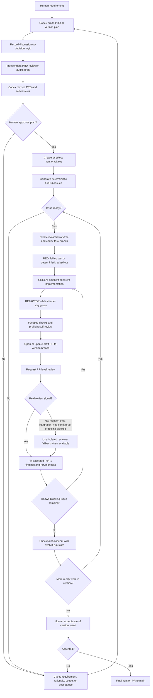

# Agentic Engineering Harness

A reusable, human-gated engineering workflow for AI coding agents.

This project packages a development methodology for turning human intent into verifiable software changes:

```text
human requirement
  -> PRD or version plan
  -> independent PRD review and revision
  -> human plan approval
  -> version integration branch
  -> structured GitHub Issues
  -> one ready Issue, one worktree, one task branch
  -> strict RED/GREEN/REFACTOR
  -> draft PR into the version branch
  -> automatic review
  -> explicit agent run closeout
  -> final version PR to main after human acceptance
```

## Harness Flow



The harness is designed for projects where AI coding agents are useful but should not be allowed to blur product intent, skip tests, self-approve work, or merge/deploy without human acceptance.

## What It Provides

- A protocol for PRD-first, human-approved planning.
- A PRD writing rule that preserves the discussion-to-decision logic behind the final design.
- A PRD review gate that uses an independent reviewer subagent/session before human plan approval when available.
- A version-branch integration model for projects where `main` stays stable.
- A large-PRD execution loop that treats local passes as checkpoints, not final completion.
- GitHub Issue contracts that are structured, deterministic, and regression-testable.
- A strict test-first implementation rule for material behavior changes.
- An agent run lifecycle gate that prevents silent stops after edits or tests.
- PR evidence templates for tests, review status, and residual risk.
- A Codex skill that can apply the workflow across projects.
- Scripts for validating Issue and PR text for common harness failures.

## Core Rules

1. Human approval of a PRD or version plan is the planning gate.
2. A PRD/version plan must record both the final design and the discussion-to-decision logic: original requirement, discussion path, assumptions, rejected alternatives, selected design rationale, and how that rationale maps to acceptance, verification, and Issues.
3. Before human approval, a PRD/version plan draft must receive an independent PRD review pass when a reviewer subagent/session is available; the drafting agent revises the PRD from accepted findings and self-reviews the revision.
4. Issues generated from an approved plan do not need a second human approval unless scope changes or ambiguity appears.
5. Standalone Issues require human confirmation before they can be marked ready.
6. Every ready Issue must have deterministic input, output, rules, constraints, acceptance criteria, verification, and a micro-plan.
7. If the agent cannot make the PRD rationale or Issue deterministic, it must ask the human to clarify.
8. Version-scoped work uses `version/vNext` as an integration branch while `main` remains stable.
9. Agents do not implement directly on `main` or `version/vNext`; they use isolated worktrees and task branches.
10. Default execution is serial: one ready Issue, one worktree, one task branch, one draft PR.
11. Material behavior changes use strict RED/GREEN/REFACTOR.
12. For whole-PRD or whole-version objectives, a local pass is a checkpoint; continue to the next unfinished item unless a real stop condition exists.
13. Status questions are answered briefly and then execution continues unless the human explicitly pauses or asks for answer-only.
14. Every material agent run ends with an explicit state such as `completed`, `checkpoint_completed_continue`, `checkpoint_review_waiting_continue`, `status_answered_continue`, `review_waiting`, `blocked_needs_human`, `blocked_tooling`, `test_failed`, or `interrupted_incomplete`; material code uses `completed` only after required independent review completes or an independent-review limitation is explicitly recorded.
15. A dirty worktree or partial PR without closeout is incomplete and must be recovered before new implementation starts.
16. Agent self-review is only preflight, never the independent review gate.
17. Review should run automatically after PR creation and must be verified with a real review signal; if PR review is unavailable, mention-only, or no PR exists yet for a material checkpoint, use an isolated reviewer subagent/session when the runtime supports it.
18. Human acceptance is required before merge, deploy, production use, irreversible actions, or risk increases.

## Repository Layout

```text
docs/                         Protocol and reference docs
templates/                    Files copied into target projects
skills/agentic-engineering-harness/
                              Codex skill
scripts/                      Deterministic validators and installers
examples/                     Example adapted project snippets
```

## Quick Start

Copy the templates into a target project:

```bash
python scripts/install_templates.py --target /path/to/project
```

Then use the skill instructions in `skills/agentic-engineering-harness/SKILL.md` when working with Codex.

## Status

This is an early harness extracted from real project work. It is intentionally conservative: serial execution first, deterministic contracts first, human gates preserved.
